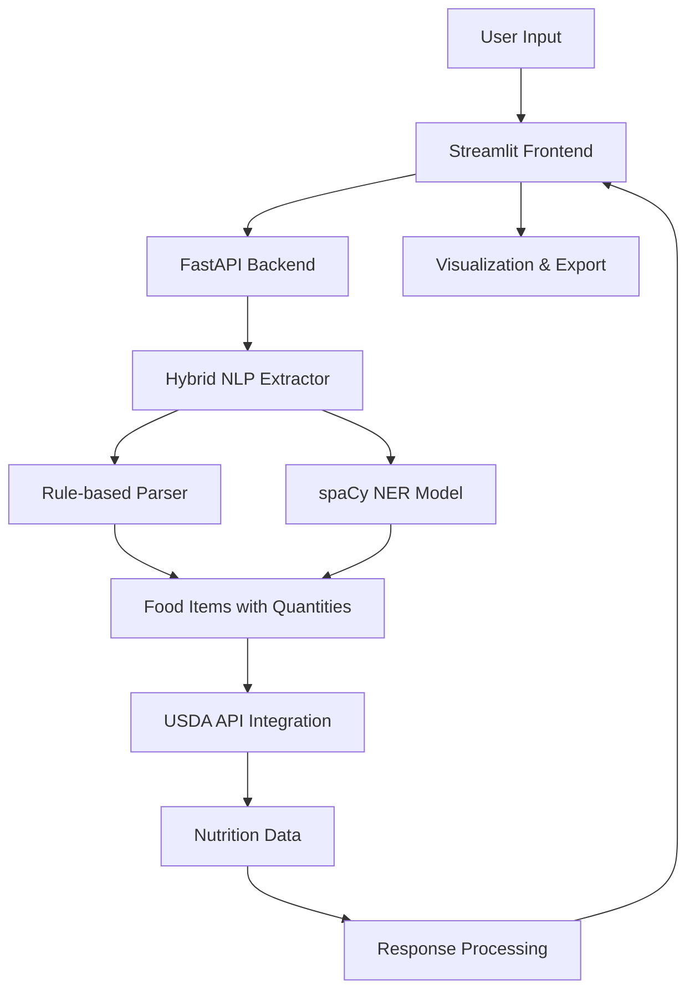

# 🥗 Nutri-Vision Text Analyzer

> **Natural Language Food Nutrition Analysis System**

Transform your food descriptions into detailed nutritional information using AI-powered text processing and USDA food database integration.


## 🌟 Features

### 🧠 **Intelligent Text Processing**
- **Natural Language Understanding**: Parse food descriptions like "I had 2 slices of bread and an apple"
- **Hybrid NLP Approach**: Combines rule-based extraction with spaCy NER models
- **Smart Quantity Detection**: Handles various formats (numbers, words, fractions)
- **Unit Conversion**: Supports cups, slices, grams, ounces, and more

### 📊 **Comprehensive Nutrition Analysis**
- **4 Core Macronutrients**: Calories, Protein, Carbohydrates, Fat
- **USDA Integration**: Real nutrition data from USDA FoodData Central API
- **Accurate Scaling**: Properly scales nutrition based on quantity and units
- **Confidence Scoring**: Shows match quality for food identification

### 🎨 **Beautiful Web Interface**
- **Interactive Dashboard**: Clean, modern Streamlit interface
- **Real-time Analysis**: Instant nutrition breakdown
- **Visual Charts**: Donut charts for macros, gauge for calories
- **Export Options**: Download results as JSON or CSV

### 🚀 **Production Ready**
- **FastAPI Backend**: High-performance async API
- **Modular Architecture**: Clean separation of concerns
- **Error Handling**: Robust error handling and logging
- **Testing Suite**: Comprehensive test coverage

## 📁 Project Structure

```
nutri-vision/
├── 📄 README.md                 # Project documentation
├── 📋 requirements.txt          # Python dependencies
├── 🚀 app.py                    # FastAPI backend application
├── 🎨 nutrition_frontend.py     # Streamlit web interface
├── ⚡ run_demo.py               # Demo launcher script
├── 🧪 test_system.py            # System test suite
├── 🔧 fix_streamlit.py          # Troubleshooting utilities
│
├── nlp/                         # Natural Language Processing
│   ├── __init__.py
│   ├── hybrid_extractor.py      # Main extraction logic
│   ├── rules.py                 # Rule-based parsing
│   ├── spacy_model.py           # spaCy model loader
│   └── preprocessing.py         # Text preprocessing
│
├── usda/                        # USDA API Integration
│   ├── __init__.py
│   └── fooddata_api.py          # USDA FoodData Central API
│
├── train/                       # Model Training (Optional)
│   ├── prepare_data.py
│   └── train_spacy.py           # spaCy NER model training
│
├── models/                      # Trained Models (Optional)
│   └── food_ner/                # Trained spaCy NER model
│
└── data/                        # Training Data (Optional)
    └── food_samples.json        # Sample training data
```

## 🚀 Quick Start

### 1. **Clone & Setup**
```bash
git clone <repository-url>
cd nutri-vision
```

### 2. **Install Dependencies**
```bash
# Install Python packages
pip install -r requirements.txt

# Or install manually
pip install fastapi uvicorn streamlit requests pandas plotly spacy word2number pydantic
```

### 3. **Get USDA API Key** (Optional)
- Visit [USDA FoodData Central](https://fdc.nal.usda.gov/api-guide.html)
- Register for a free API key
- Update `USDA_API_KEY` in `usda/fooddata_api.py`

> **Note**: The system works with built-in mock data even without an API key!

### 4. **Launch the Application**

**Option A: Use the demo launcher (Recommended)**
```bash
python run_demo.py
```
Select option `3` to start both backend and frontend.

**Option B: Manual launch**
```bash
# Terminal 1 - Start FastAPI backend
uvicorn app:app --reload

# Terminal 2 - Start Streamlit frontend
streamlit run nutrition_frontend.py
```

### 5. **Access the Application**
- 🎨 **Web Interface**: http://localhost:8501
- ⚡ **API Documentation**: http://localhost:8000/docs
- 🔧 **API Health Check**: http://localhost:8000/health

## 💡 Usage Examples

### 🎯 **Web Interface**
1. Open http://localhost:8501
2. Enter food descriptions like:
   - *"I had 2 slices of whole wheat bread and 1 apple for breakfast"*
   - *"Lunch was 200g chicken breast with 1 cup rice"*
   - *"3 eggs and 2 slices of toast"*
3. Click **"Analyze Nutrition"**
4. View detailed breakdown with charts

### 🔗 **API Usage**
```bash
# Analyze food text via API
curl -X POST "http://localhost:8000/analyze-text" \
  -H "Content-Type: application/json" \
  -d '{"description": "2 slices of bread and an apple"}'
```

```python
# Python client example
import requests

response = requests.post(
    "http://localhost:8000/analyze-text",
    json={"description": "I had oatmeal with banana and milk"}
)

result = response.json()
print(f"Total calories: {result['totals']['calories']}")
```

## 🧪 Testing

### Run System Tests
```bash
# Run comprehensive test suite
python test_system.py

# Test individual components
python debug_nlp.py    # Test NLP extraction
python debug_usda.py   # Test USDA API integration
```

### Test API Endpoints
```bash
# Health check
curl http://localhost:8000/health

# Test extraction only (no USDA lookup)
curl -X POST "http://localhost:8000/test-extraction" \
  -H "Content-Type: application/json" \
  -d '{"description": "chicken and rice"}'
```

## ⚙️ Configuration

### 🌐 **USDA API Configuration**
Edit `usda/fooddata_api.py`:
```python
USDA_API_KEY = "YOUR_API_KEY_HERE"  # Get from https://fdc.nal.usda.gov/
USDA_BASE_URL = "https://api.nal.usda.gov/fdc/v1"
```

### 🧠 **NLP Model Configuration**
The system uses a hybrid approach:
- **Rule-based extraction**: Always active, handles quantities/units
- **spaCy NER model**: Optional, improves ingredient recognition

To train your own spaCy model:
```bash
# Prepare training data in data/food_samples.json
python train/train_spacy.py
```

### 🔧 **Application Settings**
Edit configuration in respective files:
- **FastAPI settings**: `app.py`
- **Streamlit settings**: `nutrition_frontend.py`
- **API endpoints**: `app.py`

## 🏗️ Architecture

### 🔄 **Data Flow**


### 🧩 **Component Architecture**

#### **Frontend Layer** (Streamlit)
- User interface and interaction
- Data visualization (charts, metrics)
- Export functionality (JSON, CSV)

#### **API Layer** (FastAPI)
- RESTful API endpoints
- Request/response handling
- Error handling and logging

#### **NLP Layer**
- **Hybrid Extractor**: Combines multiple approaches
- **Rule-based Parser**: Regex patterns for structured extraction
- **spaCy NER**: Named entity recognition for food items

#### **Data Layer**
- **USDA Integration**: Real nutrition database
- **Mock Data**: Built-in fallback for testing
- **Unit Conversion**: Standardized measurements

## 🔧 Troubleshooting

### **Common Issues**

#### 🚫 **"Module not found" errors**
```bash
# Run the fix script
python fix_streamlit.py

# Or manually clean cache
find . -name "*.pyc" -delete
find . -name "__pycache__" -exec rm -rf {} +
```

#### 🌐 **API connection errors**
```bash
# Check if FastAPI is running
curl http://localhost:8000/health

# Restart FastAPI
uvicorn app:app --reload
```

#### 📊 **No nutrition data returned**
1. Check USDA API key configuration
2. Verify internet connection
3. System falls back to mock data automatically

#### 🧠 **Poor NLP extraction**
1. Check input format (use natural language)
2. Include quantities when possible
3. Train custom spaCy model for better accuracy

### **Debug Mode**
Enable detailed logging by setting environment variables:
```bash
export LOG_LEVEL=DEBUG
python app.py
```

## 🤝 Contributing

We welcome contributions! Here's how to get started:

### **Development Setup**
```bash
# Clone repository
git clone <repository-url>
cd nutri-vision

# Create virtual environment
python -m venv venv
source venv/bin/activate  # On Windows: venv\Scripts\activate

# Install dependencies
pip install -r requirements.txt

# Run tests
python test_system.py
```

### **Contributing Guidelines**
1. 🍴 Fork the repository
2. 🌿 Create a feature branch (`git checkout -b feature/amazing-feature`)
3. ✅ Add tests for new functionality
4. 📝 Update documentation
5. 🔍 Ensure tests pass (`python test_system.py`)
6. 📤 Submit a pull request

### **Areas for Contribution**
- 🧠 **NLP Improvements**: Better food recognition, handling of complex descriptions
- 🌐 **API Enhancements**: Additional endpoints, batch processing
- 🎨 **Frontend Features**: More visualizations, meal planning
- 🧪 **Testing**: More test cases, integration tests
- 📚 **Documentation**: Tutorials, API guides

## 📋 Requirements

### **System Requirements**
- 🐍 **Python**: 3.8 or higher
- 💾 **RAM**: 4GB minimum, 8GB recommended
- 💿 **Storage**: 1GB for dependencies and models
- 🌐 **Internet**: Required for USDA API (optional)

### **Python Dependencies**
```
fastapi>=0.104.0          # Web framework
uvicorn>=0.24.0           # ASGI server
streamlit>=1.28.0         # Frontend framework
requests>=2.31.0          # HTTP client
pandas>=2.0.0             # Data manipulation
plotly>=5.15.0           # Visualizations
pydantic>=2.4.0          # Data validation
spacy>=3.6.0             # NLP library
word2number>=2.0.0       # Text to number conversion
```

## 📄 License

This project is licensed under the MIT License - see the [LICENSE](LICENSE) file for details.

## 🙏 Acknowledgments

- 🏛️ **USDA FoodData Central**: For providing comprehensive nutrition database
- 🧠 **spaCy**: For natural language processing capabilities
- 🚀 **FastAPI**: For the high-performance web framework
- 🎨 **Streamlit**: For the beautiful web interface
- 📊 **Plotly**: For interactive visualizations

## 📞 Support

### **Getting Help**
- 📖 **Documentation**: Check this README and code comments
- 🐛 **Issues**: Open a GitHub issue for bugs or feature requests
- 💬 **Discussions**: Use GitHub Discussions for questions

### **Reporting Issues**
When reporting issues, please include:
1. 🐍 Python version and OS
2. 📋 Complete error message
3. 🔄 Steps to reproduce
4. 📝 Sample input that caused the issue

---

<div align="center">
  <strong>Built with ❤️ for healthy living and data science</strong>
  <br>
  <sub>Transform your food descriptions into actionable nutrition insights</sub>
</div>